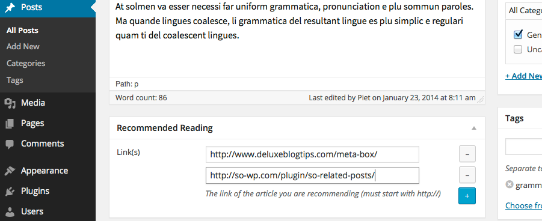
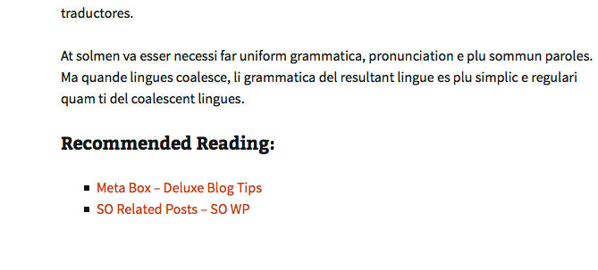

# SO Recommended Reading

###### Last updated on 2014.01.23
###### requires at least WordPress 3.6
###### tested up to WordPress 3.9-alpha
###### Author: [Piet Bos](https://github.com/senlin)
###### [Stable Version](http://wordpress.org/plugins/so-recommended-reading) (via WordPress Plugins Repository)
###### [Plugin homepage](http://so-wp.com/?p=xx)

The SO Recommended Reading plugin lets you add links to external articles that you want to recommend to your readers and places those at the bottom of your Post.

## Description

The SO Recommended Reading plugin is an Extension for the fantastic [Meta Box plugin](https://github.com/rilwis/meta-box) by [Rilwis](https://github.com/rilwis/). The purpose of the plugin is to let the user add recommendations to external content. 

With the plugin installed you will find a Recommended Reading box underneath the Post Editor. On the frontend the Recommended Articles are shown in their own class with an unordered list, right after `the_content()`. The class will use the styling of your theme and you can style it further to your own liking. 

### Background

During the [Beijing WordPress Meetup](http://www.meetup.com/wordpressbj/events/154110142/) of January 2014 a member asked me to recommend a plugin that would let him add links to articles he wants to recommend to the readers of his blog. He would like to give his readers such a Recommended Reading list on a daily basis.

Because I couldn't come up with such a plugin from the top of my head and because I am planning on releasing a series of extensions for the Meta Box plugin, I thought it would be best to put something together myself.

The titles of the URLs you input are automatically extracted.

The Extension doesn't come with any settings; you can just fill in any number of URLs to articles that you want to recommend to your readers. The meta box is only visible in the Edit Post screen.

## Frequently Asked Questions

### Where are the Settings?

You can stop looking, there are no settings. When you go into your Post Edit screen, you will see the Recommended Reading Metabox where you can fill in any number of URLs to articles that you want to recommend to your readers.

### Why is the plugin showing an error message after activation?

This plugin is an Extension for the [Meta Box plugin](http://www.deluxeblogtips.com/meta-box/). If you don't have that installed, this Extension is useless. If you click on the link that shows with the error message you will go to a new page "Required Plugin" to install the Meta Box plugin.

### I don't like the output on my Single Post, can I change anything?

Yes, you can. The output comes in its own class (`so-recommended-reading`) and in it you will find an `h4` for the title and an unordered list which has a class of `recommended-articles`. In your theme's `style.css` you can add any styling as you please.

### I have an issue with this plugin, where can I get support?

Please open an issue here on [Github](https://github.com/senlin/so-recommended-reading/issues)

## Contributions

This repo is open to _any_ kind of contributions.

## License

* License: GNU Version 2 or Any Later Version
* License URI: http://www.gnu.org/licenses/gpl-2.0.html

## Donations

* Donate link: http://so-wp.com/donations

## Connect with me through

[Github](https://github.com/senlin) 

[Google+](http://plus.google.com/+PietBos) 

[WordPress](http://profiles.wordpress.org/senlin/) 

[Website](http://senlinonline.com)

## Changelog

### 2014.01.23

* 	first release

## Screenshots

Preview of the meta box in the backend and the output on the front end.

---

